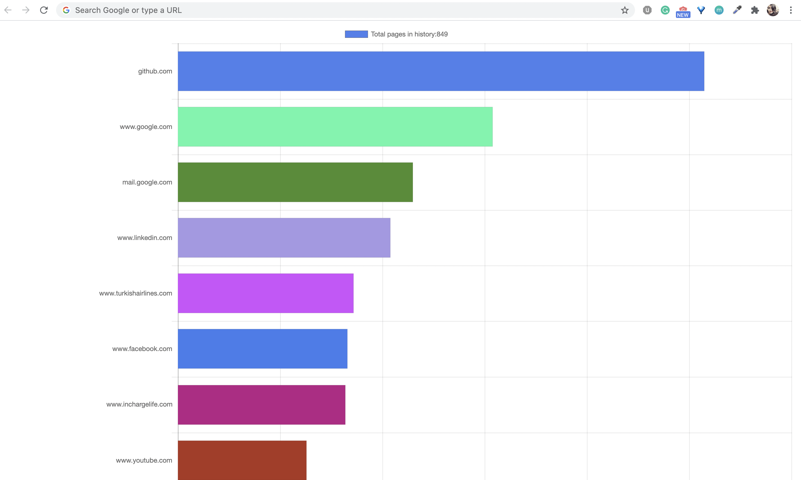

# Chrome Browsing History Analyzer

This is an initial proof of concept app, and I will be updating the extension with more advanced features and optimize the performance.

## Overview

This is a Google Chrome extension that can be used to view the statistics of your Chrome browser history, and you can see the pages that you've visited in Chrome's new tab. 

Link of this Chrome extension: [History Analyzer](https://chrome.google.com/webstore/detail/history-analyzer/ffinijbioflfopelgkhlaiphpmdembig/related)

## Dependencies
```
JavaScript
Chart.js
```

## Examples


